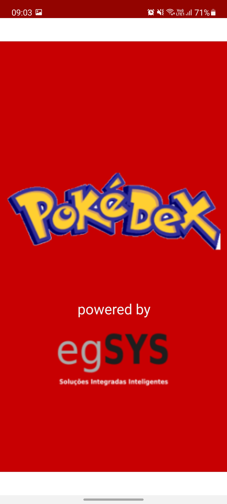
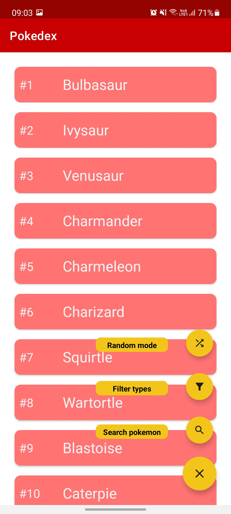
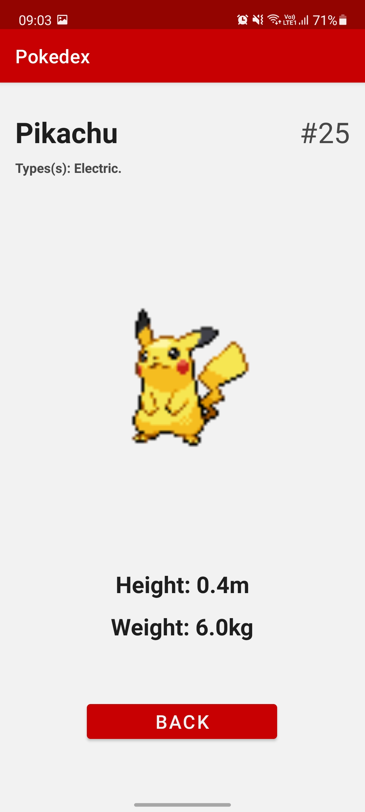
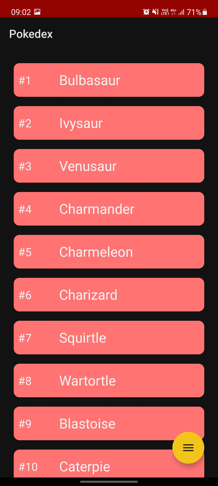
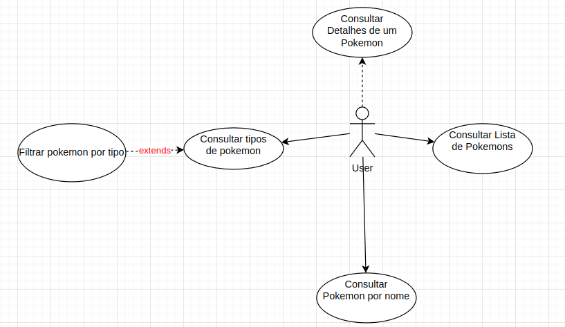
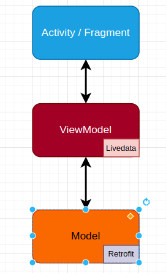

<h1 align="center">Pokedex-egsys</h1>

<p align="center">
  <a href="https://devlibrary.withgoogle.com/products/android/repos/skydoves-pokedex"></a><br>
  <a href="https://opensource.org/licenses/MIT"></a>
  <a href="https://android-arsenal.com/api?level=16"></a>
  <a href="https://github.com/kzeca"></a> 
</p>

<p align="center">  
Pokedex é aplicativo Android Nativo de nivelamento de conhecimento feito. Nesse projeto <a href="https://kotlinlang.org/">Kotlin</a>, demonstram-se técnicas de desenvolvimento modernas, como Jetpack Components(ViewModel, LiveData, Navigation), retrofit, Espresso, Animations e outros métodos baseados na arquitetura MVVM.
</p>
<p>Em resumo, é um aplicativo que faz uma listagem de pokemons por meio da https://pokeapi.co/ , assim como filtra-os por tipo e faz pesquisas pelo extenso banco de dados. Além disso, existe a funcionalidade de escolher um pokemon de maneira aleatória e lhe dar as informações básicas dele, como Tipo, Nome, Peso, Altura e seu "Número de listagem". Caso você clique em uns dos pokemons na lista apresentada em home, seus detalhes apareceram para você em outra tela. É bem divertido :)</p>
</br>

<p align="center">

</p>

## Download
Vá para [Releases](https://github.com/skydoves/Pokedex/releases) e baixe o último apk disponível.



## Stack aplicadas & Open-source Libraries
- Minimum SDK level 16
- [Kotlin](https://kotlinlang.org/) based
- Jetpack
  - Lifecycle: Adiciona um observer no lifecyle android e possui funções para lidar com as mudanças de UI nesse ciclo.
  - ViewModel: Controla data holders e as mudaças que o Lifecycle nota. Permite com que os dados se mantenham quando há mudanças de configuração (ex: Tela rotacionando).
  -Navigation: Navegação entre fragments e activities.
- Arquitetura
  - MVVM (View - ViewModel - Model)
- Repositório
    - [Retrofit2](https://github.com/square/retrofit): Construção de REST APIs.
- [Glide](https://github.com/bumptech/glide), [GlidePalette](https://github.com/florent37/GlidePalette): Carregar as imagens da web
- Testes
    - [Espresso](https://developer.android.com/training/testing/espresso): Biblioteca para testes de integração

## Amostra das telas



<p>(sim, temos até dark theme)</p>
<p>Caso você queira ter acesso a prototipação das telas, é só clicar <a href="https://www.figma.com/file/sQDa5ZRhr7NfeIIeBBuw1A/Pokedex?node-id=29%3A4">aqui</a>

## Diagramas
- De Caso de Uso: 

<br>
  - De Atividade: <a href="https://drive.google.com/file/d/1ZvfoPvWFJKk12Gt8XKiEaiKoV7kpDnta/view?usp=sharing">Link</a>

## Architecture
Pokedex-egsys é baseado na arquitetura MVVM. Segue o padrão:



## Open API


Pokedex-egsys está usando a [PokeAPI](https://pokeapi.co/) para construir RESTFul API.<br>
PokeAPI disponibiliza a interface com objetos extremamente bem detalhados para serem construidos com pokemons de todos os jeitos, tipos e formas.

# Teste você

## Requirements
- Android Studio
- Git
- Contentful CLI
- Android build tools
- An Android phone 5.0 and up
## Baixando o projeto

```bash
# Clone este repositório
$ git clone https://github.com/kzeca/pokedex-egsys.git
```
### Observação: Documentação do projeto kdoc está na pasta documentation. Lá constam mais informações relacionadas a como o projeto funciona

<br>
<br>

# License
```xml
MIT License

Copyright (c) 2022 José Carlos Peixoto Leão

Permission is hereby granted, free of charge, to any person obtaining a copy
of this software and associated documentation files (the "Software"), to deal
in the Software without restriction, including without limitation the rights
to use, copy, modify, merge, publish, distribute, sublicense, and/or sell
copies of the Software, and to permit persons to whom the Software is
furnished to do so, subject to the following conditions:

The above copyright notice and this permission notice shall be included in all
copies or substantial portions of the Software.

THE SOFTWARE IS PROVIDED "AS IS", WITHOUT WARRANTY OF ANY KIND, EXPRESS OR
IMPLIED, INCLUDING BUT NOT LIMITED TO THE WARRANTIES OF MERCHANTABILITY,
FITNESS FOR A PARTICULAR PURPOSE AND NONINFRINGEMENT. IN NO EVENT SHALL THE
AUTHORS OR COPYRIGHT HOLDERS BE LIABLE FOR ANY CLAIM, DAMAGES OR OTHER
LIABILITY, WHETHER IN AN ACTION OF CONTRACT, TORT OR OTHERWISE, ARISING FROM,
OUT OF OR IN CONNECTION WITH THE SOFTWARE OR THE USE OR OTHER DEALINGS IN THE
SOFTWARE.

```
